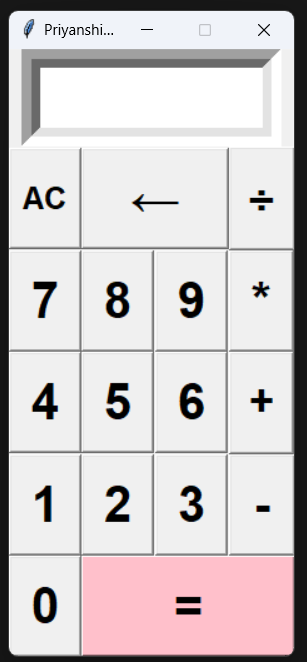

# 🧮 Python Calculator

A simple GUI calculator built with Python and Tkinter.

## 📸 Screenshot



## ✨ Features

- Addition
- Subtraction
- Multiplication
- Division
- Backspace
- Clear screen
- Error handling

## 🛠️ Built With

- Python
- Tkinter

## 🚀 How to Run

1. Clone the repository:
   ```bash
   git clone https://github.com/sonalpriyanshi529/python-calculator.git
   ```

2. Open the project folder:
   ```bash
   cd python-calculator
   ```

3. Run the application:
   ```bash
   python calculator.py
   ```

## 📄 License

This project is licensed under the MIT License.
